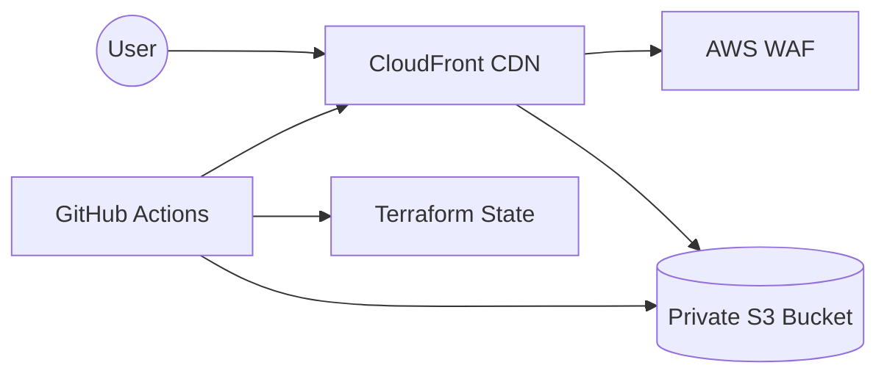

# Technical Architecture: Lumina-Static

This document provides a deep dive into the architectural decisions and data flow of the Lumina-Static platform.

## System Design

### 1. Delivery Layer (CloudFront)
- **Global Distribution**: Content is cached at 400+ Edge locations.
- **OAC (Origin Access Control)**: Replaces the legacy OAI. It ensures that the S3 bucket does not need to allow public access. OAC signs requests to S3 using SigV4.
- **Response Headers Policy**: Native CloudFront policy to inject security headers without the latency overhead of Lambda@Edge.

### 2. Security Layer (WAF)
- Associated with the CloudFront distribution.
- **Rules**:
  - `CommonRuleSet`: Protects against OWASP Top 10.
  - `IpReputationList`: Blocks known malicious actors.
- **Scope**: `CLOUDFRONT` (Global).

### 3. Storage Layer (S3)
- **Static Hosting**: Configured for private hosting.
- **Hardening**:
  - Public Access Block: All options enabled.
  - Encryption: Default AES256.
  - Versioning: Enabled for disaster recovery.

### 4. CI/CD Workflow (GitHub Actions)
- **OIDC Authentication**: No long-lived AWS keys in GitHub. The workflow assumes an IAM role via OpenID Connect.
- **Phases**:
  1. **Validation**: `terraform fmt`, `tflint`, `tfsec`.
  2. **Plan**: Generated and reviewed in PRs.
  3. **Apply**: Automated on merge to `main`.
  4. **Invalidation**: Clears CloudFront cache after S3 sync to ensure immediate updates.

## Design Trade-offs & Decisions

| Decision | Alternative | Reason |
| :--- | :--- | :--- |
| **OAC** | OAI | OAC supports all regions and provides better security. |
| **CF Policies** | Lambda@Edge | CF Policies are cheaper and have lower latency for header injection. |
| **WAF Managed** | Custom Rules | Managed rules are updated by AWS and cover 90% of use cases with less overhead. |
| **S3 Sync** | Copy | `sync` is more efficient as it only uploads changed files. |

## Observability
- **CloudWatch Metrics**: Monitoring 4xx/5xx errors on CloudFront.
- **S3 Access Logs**: Track all requests to the origin (stored in a separate logging bucket in production).
- **WAF Logs**: Visualized in CloudWatch to analyze blocked requests.
